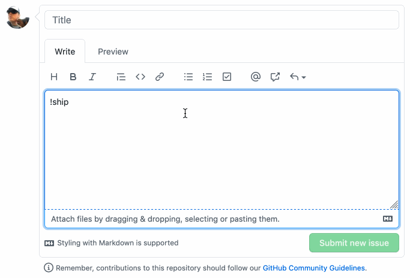

shipit
======

:shipit: shipit is a tool for software developers to add shipit squirrel images
to code comments.



### Development Tools

#### Code Style

This project uses the ['standard' eslint rules](https://github.com/standard/eslint-config-standard).

To check the files for style rule violations run:

```sh
> npx eslint ./src
```

#### Compiler

This project uses [TypeScript](https://www.typescriptlang.org/). You can check
code compiles by running:

```sh
> npx tsc --noEmit
```

#### Building

This project relies on the [`webextension-polyfill`](https://github.com/mozilla/webextension-polyfill). In order to achieve the desired set of files without a bundler there is a build script which can be ran as follows:

```sh
> .bin/build
```
